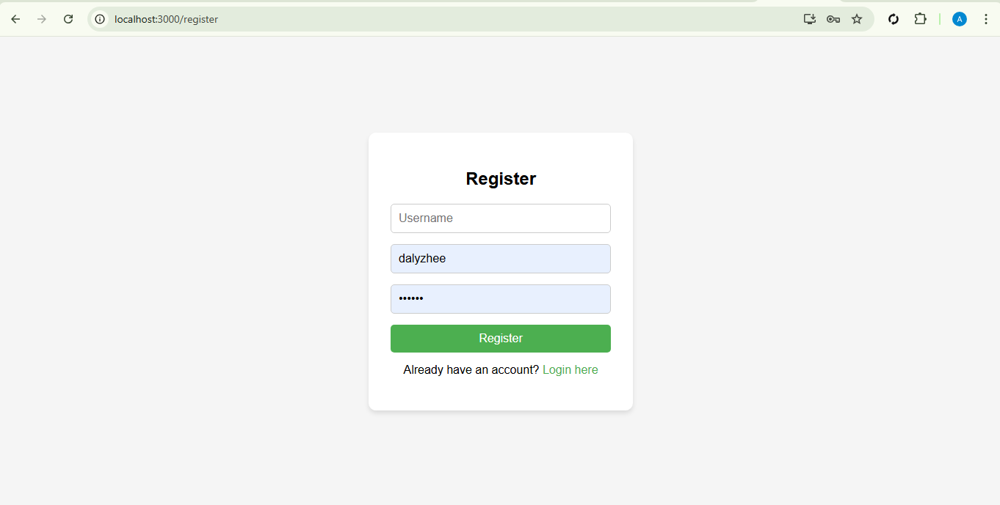
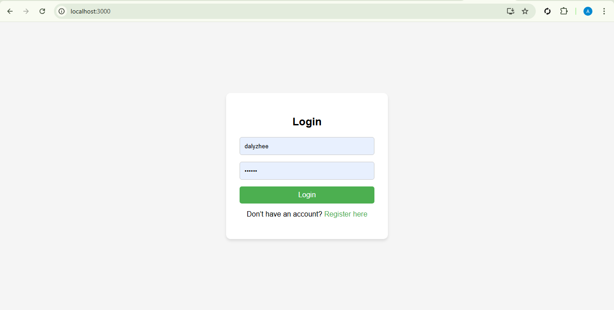
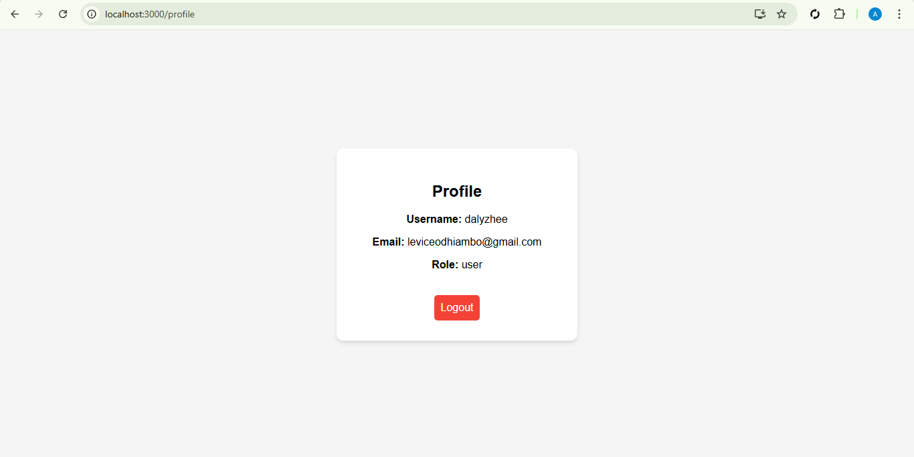
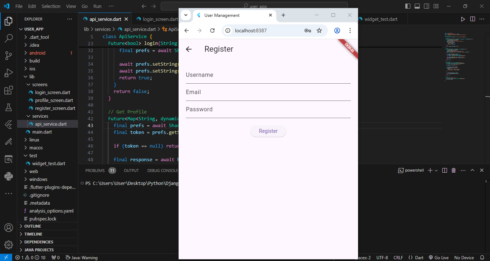
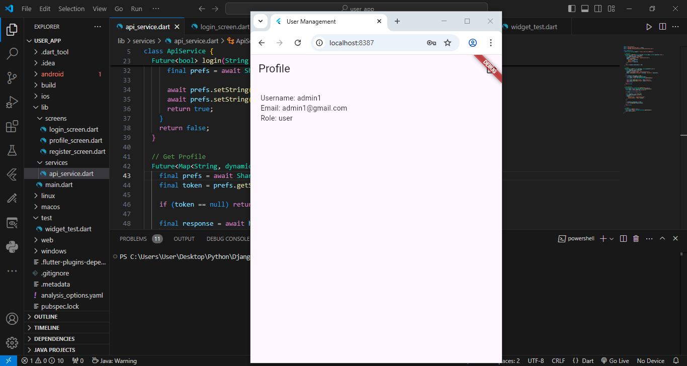

# User Management System  
**Django + Django REST Framework + JWT + React + Flutter**

A full-stack user management system built with:
- A secure Django REST API backend
- A React web dashboard
- A Flutter mobile application

---

## Backend – Django + DRF + JWT

### Features

- User Registration
- JWT Authentication (Access + Refresh)
- Role-Based Access Control
- Protected Profile APIs
- Admin User Management

### Tech Stack

- Python
- Django
- Django REST Framework (DRF)
- djangorestframework-simplejwt

### API Endpoints

| Method | Endpoint            | Description                  |
|--------|---------------------|------------------------------|
| POST   | `/api/register/`    | Register a user              |
| POST   | `/api/login/`       | Login and get JWT tokens     |
| POST   | `/api/token/refresh/` | Refresh JWT access token   |
| GET    | `/api/profile/`     | Get user profile (Protected) |
| GET    | `/api/users/`       | Admin-only user list         |

### Backend Setup

```bash
git clone <your-repo-url>
cd backend

python -m venv venv
venv\Scripts\activate   # Windows
source venv/bin/activate # Mac/Linux

pip install -r requirements.txt
python manage.py makemigrations
python manage.py migrate
python manage.py createsuperuser
python manage.py runserver
```

### Screenshots React
### Register Page

### Login Page

### Dashbaord


### Screenshots Flutter
### Register Page

### Login Page

### Dashbaord

### Setup Instructions

# Frontend – React Web App
### Features

- Login & Registration UI

- JWT token handling

- Protected dashboard

- User profile page

### React Setup
```
cd client
npm install
npm start
```

### Runs on:
```
http://localhost:3000
```

### React API Config Example
```
export const BASE_URL = "http://127.0.0.1:8000/api";
```

# Mobile App – Flutter
### Features

- User Login & Registration

- JWT Token Storage

- Protected Profile Screen

- Logout Functionality

### Flutter Setup
```
cd flutter_app   # or your folder name
flutter pub get
flutter run
```

### Flutter API Config
```
static const String baseUrl = 'http://10.0.2.2:8000/api';
```

### For real devices:
```
http://YOUR_PC_IP:8000/api
```

# Project Structure
user-management-system/
├── config/        # Django API
├── client/         # React Frontend
├── flutter_app/    # Flutter Mobile App
└── images/    # App screenshots


# Application Flow

1. User registers from React or Flutter

2. Django API creates the user

3. User logs in and receives JWT tokens

4. React/Flutter store the tokens

5. Protected APIs become accessible

# Security

- JWT-based authentication

- Secure password hashing

- Protected API endpoints

# Contact / Author

Name: Levis Odhiambo

Email: odhiambolevis967@gmail.com